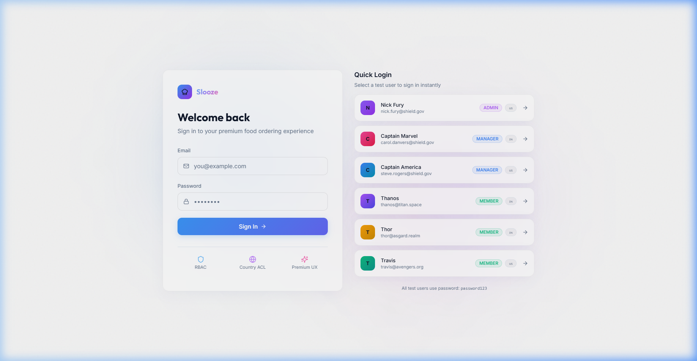
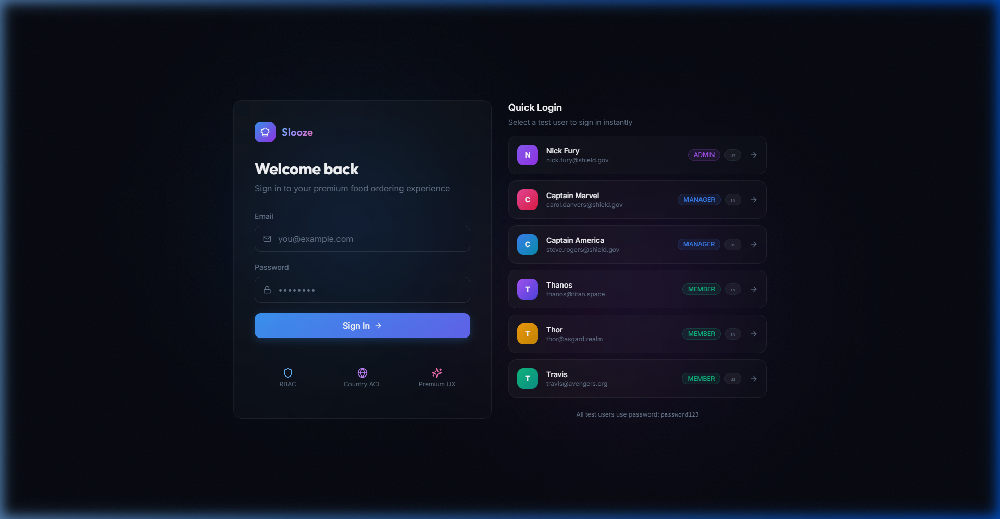
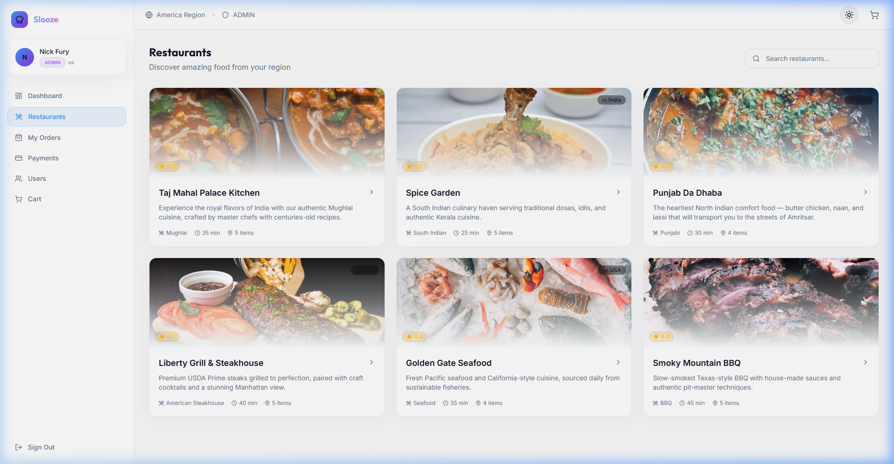
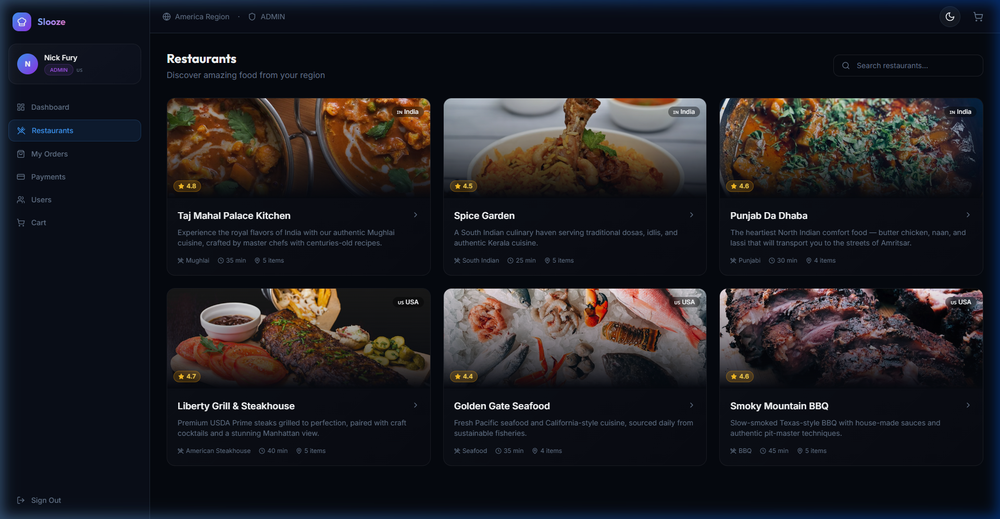
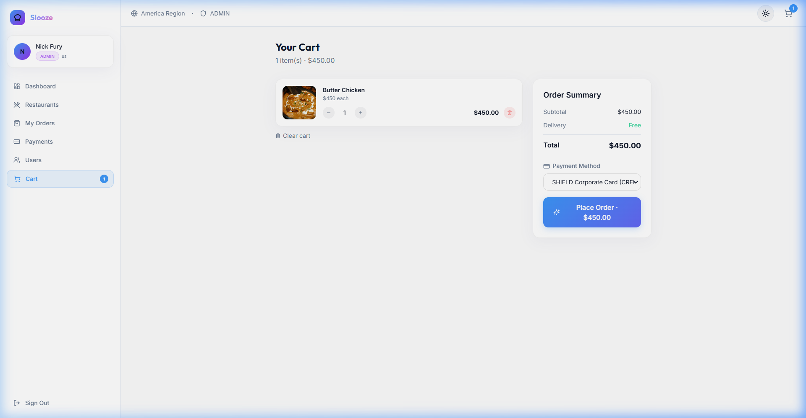
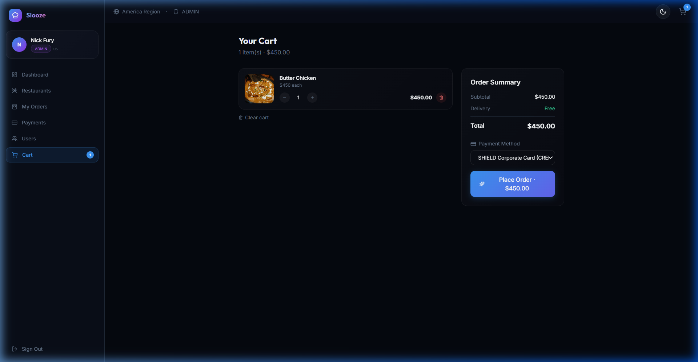
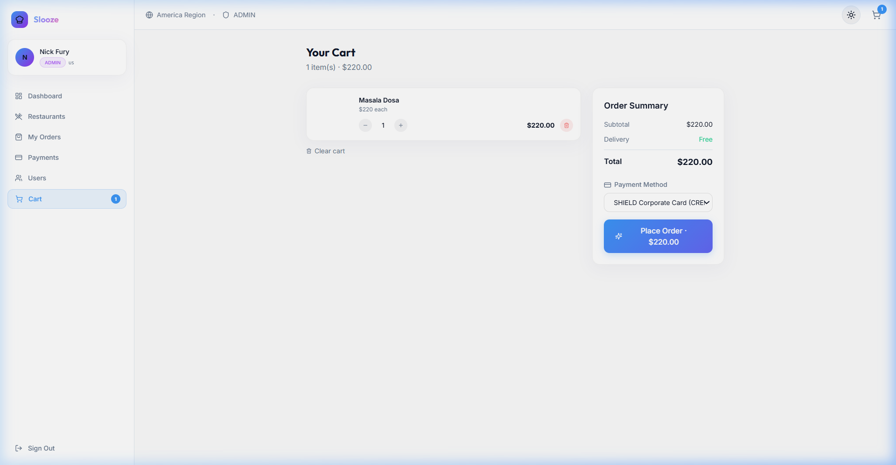
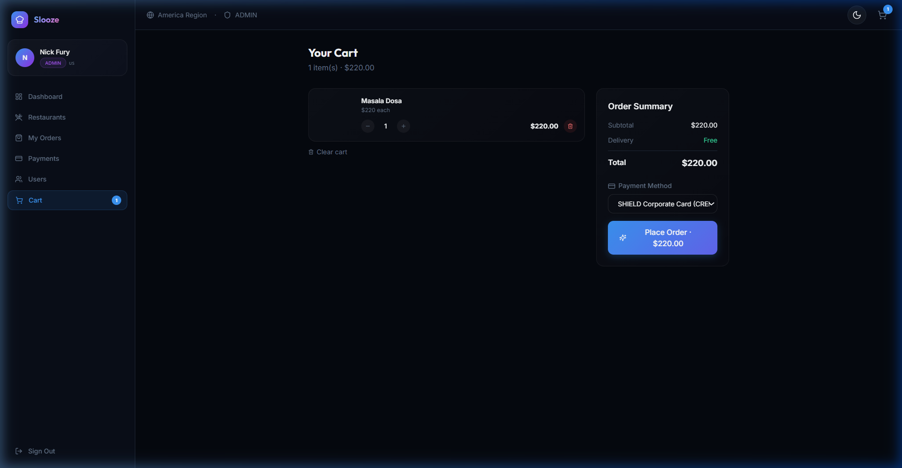

<p align="center">
  
</p>

<h1 align="center">🍽️ Slooze Food Ordering Platform</h1>

<p align="center">
  <strong>A production-grade food ordering backend with enterprise RBAC & country-based access control</strong>
</p>

<p align="center">
  
  
  
  
  
  
  
  
</p>

<p align="center">
  
  
  
  
</p>

---

## ✨ Features

<table>
<tr>
<td width="50%">

### 🔐 Enterprise Authorization
- **Role-Based Access Control** (ADMIN / MANAGER / MEMBER)
- **Country-Based Relational Access** (India 🇮🇳 / America 🇺🇸)
- Row-level data isolation
- JWT tokens with embedded role + country
- Policy enforcement at every layer

</td>
<td width="50%">

### 🏗️ Clean Architecture
- **Service Layer** — Business logic orchestration
- **Repository Pattern** — Data access abstraction
- **Dependency Injection** — FastAPI-native DI guards
- **Middleware Stack** — Logging, error handling
- **Pydantic Schemas** — Request/response validation

</td>
</tr>
<tr>
<td width="50%">

### 🍕 Food Ordering
- Browse restaurants by country
- View menus with categories
- Add items to cart
- Checkout with payment methods
- Order tracking & cancellation
- Payment method management

</td>
<td width="50%">

### 🎨 Premium Frontend
- **Dark & Light Mode** (System theme detection + toggle)
- **Glassmorphism** adaptable luxury UI design
- **Framer Motion** animated transitions
- **Role-aware** navigation (menus hide per role)
- Skeleton loaders & micro-interactions
- Responsive mobile-first layout
- Modern typography (Inter + Outfit)

</td>
</tr>
</table>

---

## 🌗 Design System & Theming

The frontend application features a complete Enterprise Design System powered by `next-themes` and a centralized CSS variable architecture.

- **Token Architecture**: All spacing, typography, and colors are controlled via CSS custom properties mapped to Tailwind. This ensures identical visual weight across both Light and Dark modes.
- **System Sync**: Uses `matchMedia` event listeners to automatically synchronize the application theme with the operating system preference in real-time.
- **Accessibility**: Hardened with strict WCAG contrast compliance. All interactive components feature comprehensive keyboard navigation support, visible focus rings (`focus-visible`), and ARIA labels.
- **Performance Considerations**: Implements an early `<script>` injection before React hydration to completely eliminate Flash of Unstyled Content (FOUC). State changes happen under 16ms utilizing GPU-accelerated CSS transitions and Framer Motion layouts.

## 🖼️ Product Showcase

### 🌓 Theme Comparison Gallery

| Page | Light Mode | Dark Mode |
|:---:|:---:|:---:|
| **Login** |  |  |
| **Restaurants** |  |  |
| **Menu & Cart** |  |  |
| **Checkout** |  |  |

---

## 🏛️ Architecture

```
┌─────────────────────────────────────────────────────────────┐
│                     NGINX REVERSE PROXY                      │
├──────────────────────────┬──────────────────────────────────┤
│     Next.js Frontend     │       FastAPI Backend             │
│  ┌──────────────────┐    │  ┌────────────────────────────┐  │
│  │  Pages & Layouts  │    │  │  API ← Guards ← Services   │  │
│  │  Context Stores   │────┼──│  ← Repositories ← Models  │  │
│  │  Components       │    │  │  ← RBAC Policy Engine      │  │
│  └──────────────────┘    │  └────────────────────────────┘  │
├──────────────────────────┴──────────────────────────────────┤
│              PostgreSQL            │         Redis            │
└────────────────────────────────────┴────────────────────────┘
```

---

## 🔑 Role Access Matrix

| Feature | Admin 👑 | Manager 🛡️ | Member 👤 |
|---------|:--------:|:----------:|:---------:|
| View restaurants & menu | ✅ | ✅ | ✅ |
| Create order (add food items) | ✅ | ✅ | ✅ |
| Checkout & pay | ✅ | ✅ | ❌ |
| Cancel an order | ✅ | ✅ | ❌ |
| Add / modify payment methods | ✅ | ❌ | ❌ |
| View all orders | ✅ | ❌ | ❌ |
| Manage users | ✅ | ❌ | ❌ |
| View dashboard stats | ✅ | ✅ | ❌ |

### 🌍 Country Access Control

> Users can **only** access restaurants, menus, and orders from their assigned country.

| User | Country | Sees |
|------|---------|------|
| 🇮🇳 India users | India | Taj Mahal Kitchen, Spice Garden, Punjab Da Dhaba |
| 🇺🇸 America users | America | Liberty Grill, Golden Gate Seafood, Smoky BBQ |
| 👑 Admin | ALL | Full access across all countries |

---

## 🧪 Test Users

| Character | Email | Role | Country | Password |
|-----------|-------|------|---------|----------|
| **Nick Fury** | nick.fury@shield.gov | `ADMIN` | 🇺🇸 America | password123 |
| **Captain Marvel** | carol.danvers@shield.gov | `MANAGER` | 🇮🇳 India | password123 |
| **Captain America** | steve.rogers@shield.gov | `MANAGER` | 🇺🇸 America | password123 |
| **Thanos** | thanos@titan.space | `MEMBER` | 🇮🇳 India | password123 |
| **Thor** | thor@asgard.realm | `MEMBER` | 🇮🇳 India | password123 |
| **Travis** | travis@avengers.org | `MEMBER` | 🇺🇸 America | password123 |

---

## 🚀 Quick Start

### Option 1: Docker Compose (Recommended)

```bash
# Clone the repository
git clone <repo-url>
cd back-end-challenge

# Copy environment file
cp .env.example .env

# Build and start all services
docker-compose up --build

# Access the application:
# Frontend:  http://localhost:3000
# Backend:   http://localhost:8000
# API Docs:  http://localhost:8000/docs
# Nginx:     http://localhost:8080
```

### Option 2: Local Development

```bash
# ── Start Database & Redis ──
docker-compose up -d postgres redis

# ── Backend ──
cd backend
python -m venv venv
source venv/bin/activate  # Windows: venv\Scripts\activate
pip install -r requirements.txt
uvicorn app.main:app --reload --host 0.0.0.0 --port 8000

# ── Frontend (new terminal) ──
cd frontend
npm install
npm run dev
```

### Makefile Commands

```bash
make build          # Build all containers
make up             # Start all services
make down           # Stop all services
make dev-backend    # Run backend in dev mode
make dev-frontend   # Run frontend in dev mode
make dev-db         # Start only DB + Redis
make seed           # Seed database
make logs           # View all logs
make clean          # Remove containers + volumes
```

---

## 📡 API Documentation

### Interactive Docs
- **Swagger UI**: [http://localhost:8000/docs](http://localhost:8000/docs)
- **ReDoc**: [http://localhost:8000/redoc](http://localhost:8000/redoc)

### API Examples

#### Login
```bash
curl -X POST http://localhost:8000/api/v1/auth/login \
  -H "Content-Type: application/json" \
  -d '{"email": "nick.fury@shield.gov", "password": "password123"}'
```

#### List Restaurants (with token)
```bash
curl http://localhost:8000/api/v1/restaurants \
  -H "Authorization: Bearer <token>"
```

#### Create Order
```bash
curl -X POST http://localhost:8000/api/v1/orders \
  -H "Authorization: Bearer <token>" \
  -H "Content-Type: application/json" \
  -d '{
    "restaurant_id": "rest-taj-mahal",
    "items": [{"menu_item_id": "<id>", "quantity": 2}]
  }'
```

#### Checkout Order
```bash
curl -X POST http://localhost:8000/api/v1/orders/<order_id>/checkout \
  -H "Authorization: Bearer <token>" \
  -H "Content-Type: application/json" \
  -d '{"payment_method_id": "<payment_method_id>"}'
```

---

## 📁 Project Structure

```
back-end-challenge/
├── backend/
│   ├── app/
│   │   ├── api/              # API route handlers
│   │   ├── core/             # Config, security, logging
│   │   ├── database/         # Session management, seed data
│   │   ├── middleware/        # Request logging, error handling
│   │   ├── models/           # SQLAlchemy ORM models
│   │   ├── rbac/             # Permission matrix, auth guards
│   │   ├── repositories/     # Data access layer
│   │   ├── schemas/          # Pydantic DTOs
│   │   ├── services/         # Business logic layer
│   │   └── main.py           # FastAPI application entry
│   ├── alembic/              # Database migrations
│   ├── requirements.txt
│   └── Dockerfile
├── frontend/
│   ├── src/
│   │   ├── app/              # Next.js pages (App Router)
│   │   ├── components/       # Reusable UI components
│   │   └── lib/              # API client, types, stores
│   ├── package.json
│   └── Dockerfile
├── docs/
│   ├── Architecture.md       # System architecture
│   ├── RBAC-Design.md        # Authorization design
│   ├── Database-Design.md    # ER diagram & tables
│   ├── Scaling.md            # Scaling strategy
│   └── Security.md           # Security documentation
├── nginx/
│   └── nginx.conf            # Reverse proxy config
├── docker-compose.yml
├── Makefile
├── .env.example
├── postman_collection.json
└── README.md
```

---

## 🏗️ System Design Highlights

### Authorization Flow
```
Request → JWT Extraction → Token Validation → User Lookup
  → Permission Check (Role Matrix) → Country Guard → Service Layer
```

### Order State Machine
```
CART → PLACED → CONFIRMED → PREPARING → DELIVERED
  ↓                ↓
CANCELLED      CANCELLED (with refund)
```

### Caching Strategy
```
Client → API → Redis (cache-aside) → PostgreSQL
```

---

## 📚 Documentation

| Document | Description |
|----------|-------------|
| [Architecture](./docs/Architecture.md) | System design, component diagram, data flow |
| [RBAC Design](./docs/RBAC-Design.md) | Permission model, role hierarchy, policy enforcement |
| [Database Design](./docs/Database-Design.md) | ER diagram, table definitions, indexes |
| [Scaling](./docs/Scaling.md) | Horizontal scaling, caching, async workers |
| [Security](./docs/Security.md) | JWT auth, access isolation, injection protection |

---

## 🛠️ Tech Stack

| Layer | Technology |
|-------|-----------|
| **Backend** | Python · FastAPI · SQLAlchemy · Alembic |
| **Database** | PostgreSQL 16 |
| **Cache** | Redis 7 |
| **Auth** | JWT (python-jose) · bcrypt |
| **Frontend** | Next.js 14 · TypeScript · TailwindCSS |
| **Animations** | Framer Motion |
| **DevOps** | Docker · Docker Compose · Nginx |
| **Logging** | structlog (structured JSON logging) |
| **Validation** | Pydantic v2 |

---

## 👨‍💻 Developed by

<div align="center">
  <a href="https://www.linkedin.com/in/sudheerkonduboina/">
    
  </a>
  <br/>
  <h3>Sudheer Konduboina</h3>
  <p>Software Engineer(Backend) & AIML Engineer</p>
  <a href="https://www.linkedin.com/in/sudheerkonduboina/">
    
  </a>
</div>

---

## © Copyright Notice

**© Slooze. All Rights Reserved.**
